# 이 대화 상자 닫기

## Abstract

Eyeriss is an accelerator for state-of-the-art deep convolutional neural networks (CNNs). It optimizes for the energy efficiency of the entire system, including

## Authors

Yu-Hsin Chen, Tushar Krishna, Joel S. Emer, Vivienne Sze

## Introduction

Deep learning using convolutional neural networks (CNNs) [\[1\]](ref1) has achieved unprecedented accuracy on many modern AI applications [\[2\]](ref2)–​[\[9\]](ref9). However, state-of-the-art CNNs require tens to hundreds of megabytes of parameters on billions of operations in a single inference pass, creating significant data movement from on-chip and off-chip to support the computation. Since data movement can be more energy-consuming than computation [\[10\]](ref10), [\[11\]](ref11), the processing of CNNs has to not only provide high parallelism for high throughput but also optimize for the data movement of the entire system in order to achieve high energy efficiency. In addition, this optimization needs to adapt to the varying shapes of the high-dimensional convolutions in CNN.

To address these challenges, it is crucial to design a compute scheme, called a  *dataflow*, that can support a highly parallel compute paradigm while optimizing the energy cost of data movement from both on-chip and off-chip. The cost of data movement is reduced by exploiting data reuse in a multilevel memory hierarchy, and the hardware needs to be reconfigurable to support different shapes. To further improve energy efficiency, data statistics can also be exploited. Specifically, CNN data contains many zeros. Techniques such as compression and data adaptive processing can be applied to save both memory bandwidth and processing power.

Previous work has proposed hardware designs for CNN acceleration [\[12\]](ref12)–​[\[22\]](ref22). However, most of them only have simulation results that are not verified by the measured results from fabricated chips; implementations using FPGA also do not reveal the actual throughput and energy efficiency of the architecture. A few efforts have demonstrated the measurement results of fabricated chips [\[23\]](ref23)–​[\[25\]](ref25). However, these works do not benchmark their implementations using widely used publicly available state-of-the-art CNNs, which is critical to the hardware evaluation. Specifically, Park  *et al*. [\[23\]](ref23) propose a deep-learning processor for running both training and inference using an MIMD architecture, which was tested on a custom four-layer network using $5\times 5$ filters. Cavigelli  *et al*. [\[24\]](ref24) present a CNN accelerator for inference that is tested on a four-layer CNN using $7\times 7$ filters. Sim  *et al*. [\[25\]](ref25) demonstrate a CNN processor and only report the theoretical peak throughput along with the power measured on a CNN for the MNIST data set [\[26\]](ref26), which has storage and computation requirements that are orders of magnitude lower than the state-of-the-art CNNs. With the exception of [\[24\]](ref24), these works did not report the required DRAM bandwidth for the proposed compute schemes. It is not sufficient to look at the processor power alone, since DRAM access is one of the most important factors dictating the system energy efficiency.

In this paper, we have implemented and fabricated a CNN accelerator, called Eyeriss, that can support high throughput CNN inference and optimizes for the energy efficiency of the  *entire system*, including the accelerator chip and off-chip DRAM. It is also reconfigurable to handle different CNN shapes, including square and nonsquare filters. The main features of Eyeriss are as follows.

1. A spatial architecture using an array of 168 processing elements (PEs) that creates a four-level memory hierarchy. Data movement can exploit the low-cost levels, such as the PE scratch pads (spads) and the inter-PE communication, to minimize data accesses to the high-cost levels, including the large on-chip global buffer (GLB) and the off-chip DRAM.
1. A CNN dataflow, called  *Row Stationary*  (RS), that reconfigures the spatial architecture to map the computation of a given CNN shape and optimize for the best energy efficiency.
1. A network-on-chip (NoC) architecture that uses both multicast and point-to-point single-cycle data delivery to support the RS dataflow.
1. Run-length compression (RLC) and PE data gating that exploit the statistics of zero data in CNNs to further improve energy efficiency.

The performance of Eyeriss, including both the chip energy efficiency and required DRAM accesses, is benchmarked with two publicly available and widely used state-of-the-art CNNs: AlexNet [\[2\]](ref2) and VGG-16 [\[3\]](ref3). These CNNs are designed for the most challenging computer vision task to date: 1000-class image classification on the ImageNet data set [\[27\]](ref27). Eyeriss has also been integrated with Caffe [\[28\]](ref28) to demonstrate such application running in real-time [\[29\]](ref29).

## CNN Basics

The CNN algorithm is constructed by stacking multiple computation layers for feature extraction and classification [\[30\]](ref30). Modern CNNs achieve their superior accuracy by building a very deep hierarchy of layers [\[2\]](ref2)–​[\[5\]](ref5), [\[7\]](ref7), which transform the input image data into highly abstract representations called feature maps (fmaps).

The primary computation in the CNN layers is performing the high-dimensional convolutions. A layer applies **filters** on the input fmaps (**ifmaps**) to extract embedded characteristics and generate the output fmaps (**ofmaps**) by accumulating the partial sums (**psums**). The dimensions of both filters and fmaps are 4-D: each filter or fmap is a 3-D structure consisting of multiple 2-D planes, i.e., channels,[1](fn1) and a batch of 3-D ifmaps is processed by a group of 3-D filters in a layer. In addition, there is a 1-D bias that is added to the filtering results. Given the shape parameters in [Table I](img/ieee_7738524_table1.gif), the computation of a layer is defined as 

$$
\begin{align}&\hspace {-2pc}\mathbf {O}[z][u][x][y]\notag \\=&\mathrm {ReLU}\left ({\mathbf {B}[u] + \sum _{k=0}^{C-1}\sum _{i=0}^{R-1}\sum _{j=0}^{S-1}\mathbf {I}[z][k][Ux+i][Uy+j]}\right.\notag \\&\qquad \qquad \left.{\times \mathbf {W}[u][k][i][j]\vphantom {\left ({\mathbf {B}[u] + \sum _{k=0}^{C-1}\sum _{i=0}^{R-1}\sum _{j=0}^{S-1}\mathbf {I}[z][k][Ux+i][Uy+j]}\right.}}\right),\notag \\&\quad 0\leq z <N,\quad 0\leq u <M, ~0\leq y <E, ~0\leq x <F\notag \\ E=&(H-R+U)/U,\quad F = (W-S+U)/U \end{align}
$$

 where $\mathbf {O}$, $\mathbf {I}$, $\mathbf {W}$, and $\mathbf {B}$ are the matrices of the ofmaps, ifmaps, filters, and biases, respectively. $U$ is a given stride size. [Fig. 1](img/ieee_7738524_fig1.gif) shows a visualization of this computation (ignoring biases). After the convolutions, activation functions, such as the rectified linear unit (ReLU) [\[31\]](ref31), are applied to introduce nonlinearity.

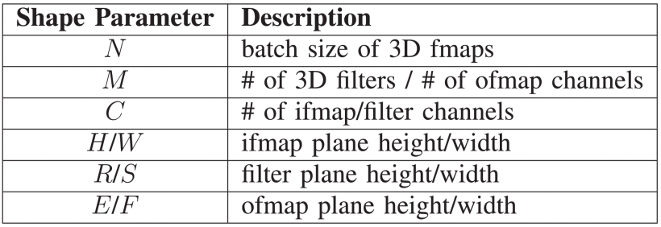

**TABLE I** 

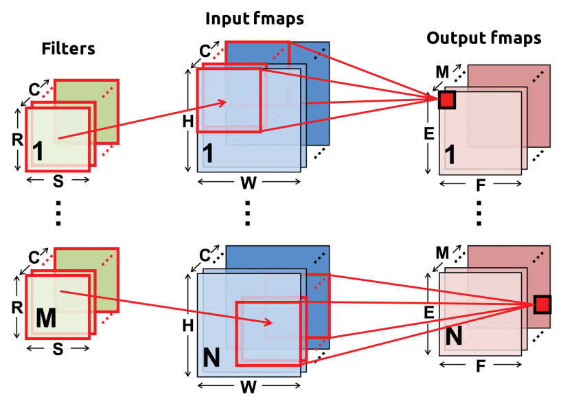

**Fig. 1.** Computation of a CNN layer.

## System Architecture

### A. Overview

[Fig. 2](img/ieee_7738524_fig2.gif) shows the top-level architecture and memory hierarchy of the Eyeriss system. It has two clock domains: the core clock domain for processing, and the link clock domain for communication with the off-chip DRAM through a 64-b bidirectional data bus. The two domains run independently and communicate through an asynchronous FIFO interface. The core clock domain consists of a spatial array of 168 PEs organized as a $12\times 14$ rectangle, a 108-kB GLB, an RLC CODEC, and an ReLU module. To transfer data for computation, each PE can either communicate with its neighbor PEs or the GLB through an NoC, or access a memory space that is local to the PE called spads ([Section V-C](#c-processing-element-and-data-gating)). Overall, there are four levels of memory hierarchy in the system (in decreasing energy per access): DRAM, GLB, inter-PE communication, and spads.

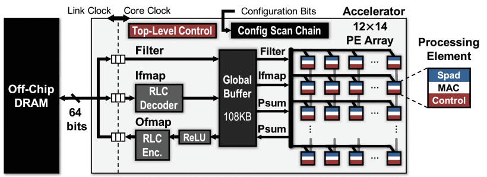

**Fig. 2.** Eyeriss system architecture.

### B. System Control and Configuration

The accelerator has two levels of control hierarchy. The top-level control coordinates: 1) traffic between the off-chip DRAM and the GLB through the asynchronous interface; 2) traffic between the GLB and the PE array through the NoC; and 3) operation of the RLC CODEC and ReLU module. The lower-level control consists of control logic in each PE, which runs independently of each other. Therefore, even though the 168 PEs are identical and run under the same core clock, their processing states do not need to proceed in lock steps, i.e., not as a systolic array. Each PE can start its own processing as soon as any fmaps or psums arrives (fmaps or psums).

The accelerator runs the processing of a CNN layer-by-layer. For each layer, it first loads the configuration bits into a 1794 b scan chain serially to reconfigure the entire accelerator, which takes less than 100 $\mu \text{s}$. These bits configure the accelerator for the processing of filters and fmaps in a certain shape, which includes setting up the PE array computation mappings ([Section IV-A](#a-energy-efficient-dataflow-row-stationary)) and NoC data delivery patterns ([Section V-B](#b-network-on-chip)). They are generated offline and are statically accessed at runtime. Then, the accelerator loads tiles of the ifmaps and filters from DRAM for processing, and the computed ofmaps are written back to DRAM. Batches of ifmaps for the same layer can be processed sequentially without further reconfigurations of the chip.

## Energy-Efficient Features

The Eyeriss chip focuses on two main approaches to improve the energy efficiency: 1) reducing data movement and 2) exploiting data statistics.

### A. Energy-Efficient Dataflow: Row Stationary

In Eyeriss, we propose the RS dataflow that maps the computation of any given CNN shape onto the PE array. It is reconfigurable for different shapes and optimizes for the best energy efficiency [\[32\]](ref32). The RS dataflow minimizes data movement for all data types (ifmap, filter, and psums/ofmap) simultaneously and takes the energy costs at different levels of the memory hierarchy into account. Data accesses to the high-cost DRAM and GLB are minimized through maximally reusing data from the low-cost spads and inter-PE communication. Compared with existing dataflows from previous works, the RS dataflow is 1.4–2.5 times more energy efficient in AlexNet, a widely used CNN [\[2\]](ref2).

To minimize the movement of ifmaps and filters, the goal is to maximize three forms of data reuse.

1. *Convolutional Reuse:* Each filter weight is reused $E\times F$ times in the same ifmap plane, and each ifmap pixel is usually reused $R\times S$ times in the same filter plane.
1. *Filter Reuse:* Each filter weight is reused across the batch of $N$ ifmaps.
1. *Ifmap Reuse:* Each ifmap pixel is reused across $M$ filters (to generate $M$ ofmap channels).

To minimize the movement of psums, it is desirable that the **psum accumulation** across $C\times R\times S$ values into one ofmap value can be done as soon as possible to save both the storage space and memory R/W energy. However, maximum input data reuse cannot be achieved simultaneously with immediate psum reduction, since the psums generated by multiply and accumulations (MACs) using the same filter or ifmap value are not reducible. Thus, the RS dataflow uses a systematic approach to optimize for all data types simultaneously as follows.

*1-D Convolution Primitive in a PE:* The RS dataflow first divides the computation of [(1)](deqn1) into 1-D convolution primitives that can all run in parallel. Each primitive operates on one row of filter weights and one row of ifmap values, and generates one row of psums. The psums from different primitives are further accumulated together to generate the ofmap values. By mapping each primitive to one PE for processing, the computation of each *row pair stays stationary* in the PE. Due to the sliding window processing of the primitive as shown in [Fig. 3](img/ieee_7738524_fig3.gif), each PE can use the local spads for both convolutional data reuse and psum accumulation. Since only a sliding window of data has to be retained at a time, the required spad capacity depends only on the filter row size ($S$) but not the ifmap row size ($W$), and is equal to: 1) $S$ for a row of filter weights; 2) $S$ for a sliding window of ifmap values; and 3) 1 for the psum accumulation. In AlexNet, for example, possible values for $S$ are 11 (layer CONV1), 5 (layer CONV2), and 3 (layers CONV3–CONV5). Therefore, the minimum spad capacity required for filter, ifmap, and psum is 11, 11, and 1, respectively, to support all layers.

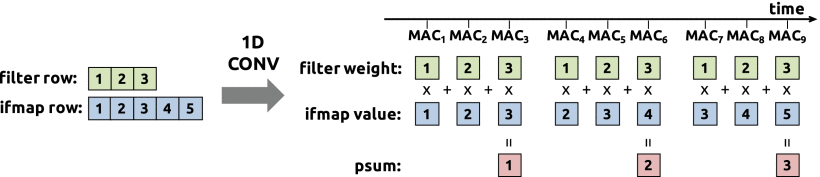

**Fig. 3.** Processing sequence of a 1-D convolution primitive in a PE. In this example, the filter row size (S) and the ifmap row size (W) are 3 and 5, respectively.

*2-D Convolution PE Set:* A 2-D convolution is composed of many 1-D convolution primitives, and its computation: 1) shares the same row of filter or ifmap across primitives and 2) accumulates the psums from multiple primitives together. Therefore, a PE Set, as shown in [Fig. 4](img/ieee_7738524_fig4.gif), is grouped to run a 2-D convolution and exploit the interprimitive convolutional reuse and psum accumulation, which avoids data accesses from GLB and DRAM. In a set, each row of filter is reused horizontally, each row of ifmap is reused diagonally, and rows of psum are accumulated vertically. The dimensions of a PE set are determined by the filter and ofmap size of a given layer. Specifically, the height and the width of the PE set are equal to the number of filter rows ($R$) and ofmap rows ($E$), respectively. In AlexNet, the PE sets are of size $11\times 55$ (CONV1), $45\times 27$ (CONV2), and $3\times 13$ (CONV3–CONV5).

![Fig. 4. - Dataflow in a PE set for processing a 2-D convolution. (a) Rows of filter weights are reused across PEs horizontally. (b) Rows of ifmap values are reused across PEs diagonally. (c) Rows of psums are accumulated across PEs vertically. Reuse and accumulation of data within a PE set reduce accesses to the GLB and DRAM, saving data movement energy cost. In this example, the number of filter rows ($R$), ifmap rows ($H$), and ofmap rows ($E$) are 3, 5, and 3, respectively. Therefore, the PE set size is $3\times 3$. Filter and ifmap values from different rows are sent to the PE set in a time-interleaved fashion; all the PEs that reuse the same value receive it at the same cycle. The psums generated from one PE are sent to its neighbor PE immediately.](img/ieee_7738524_fig4.gif)

**Fig. 4.** Dataflow in a PE set for processing a 2-D convolution. (a) Rows of filter weights are reused across PEs horizontally. (b) Rows of ifmap values are reused across PEs diagonally. (c) Rows of psums are accumulated across PEs vertically. Reuse and accumulation of data within a PE set reduce accesses to the GLB and DRAM, saving data movement energy cost. In this example, the number of filter rows (R), ifmap rows (H), and ofmap rows (E) are 3, 5, and 3, respectively. Therefore, the PE set size is3×3. Filter and ifmap values from different rows are sent to the PE set in a time-interleaved fashion; all the PEs that reuse the same value receive it at the same cycle. The psums generated from one PE are sent to its neighbor PE immediately.

*PE Set Mapping:* The dimensions of a PE set are a function of the shape of a layer and are independent of the physical dimensions of the PE array. Therefore, a strategy is required to map these PE sets onto the PE array. This mapping strategy should map a set using nearby PEs in the array to take the advantage of local data sharing and psum accumulation. In Eyeriss, a PE set can be mapped to any group of PEs in the array that has the same dimensions. However, there are two exceptions.

1. *PE Set Has More Than 168 PEs:* This can be solved by *strip mining* the 2-D convolution, i.e., the PE set only processes $e$ rows of ofmap at a time, where $e\leq E$. The dimensions of the strip-mined PE set then becomes $R\times e$ and can fit into the PE array.
1. *PE Set Has Less Than 168 PEs, But Has Width Larger Than 14 or Height Larger Than 12:* A PE set that is too wide is divided into separated segments that are mapped independently to the array. Eyeriss currently does not support the mapping of a PE set that is taller than the height of the PE array. Therefore, the maximum natively supported filter height is 12.

An example of these two exceptions can be seen from the PE set mapping of layers CONV1–CONV5 in AlexNet onto the $12\times 14$ PE array of Eyeriss as shown in [Fig. 5](img/ieee_7738524_fig5.gif). The $11\times 55$ PE set of CONV1 is strip-mined to $11\times 7$. The strip-mined PE set width is determined by a process that optimizes for overall energy efficiency as introduced in [\[32\]](ref32). The $5\times 27$ PE set of CONV2 is divided into two segments with dimensions $5\times 14$ and $5\times 13$, respectively, and each segment is independently mapped onto the PE array. Finally, the $3\times 13$ PE set of CONV3–CONV5 can easily fit into the PE array. Except for CONV2, the PE array can fit multiple PE sets in parallel as shown in [Fig. 5](img/ieee_7738524_fig5.gif), and the RS dataflow further defines how to fully utilize hardware resources to minimize data movement in the dimensions beyond 2-D. This mapping strategy is realized by a custom designed NoC that is also optimized for energy efficiency ([Section V-B](#b-network-on-chip)).

**Fig. 5.** Mapping of the PE sets on the spatial array of 168 PEs for the CONV layers in AlexNet. For the colored PEs, the PEs with the same color receive the same ifmap value in the same cycle. The arrow between two PE sets indicates that their psums can be accumulated together.

*Dimensions Beyond 2-D in PE Array:* Processing of many 2-D convolutions is required to complete the computation of [(1)](deqn1) due to the three additional dimensions: batch size ($N$), number of channels ($C$), and number of filters ($M$). Assuming varying only 1-D at a time and fixing the rest of the two the same, two 2-D convolutions that use: 1) different ifmaps reuse the same filter (i.e., filter reuse); 2) different filters reuse the same ifmap (i.e., ifmap reuse); and 3) filters and ifmaps from different channels can accumulate their psums together (i.e., psum accumulation). The filter reuse can be exploited simply by streaming different ifmaps through the same PE set sequentially [[Fig. 6(a)](img/ieee_7738524_fig6.gif)], since the filter stays constant in the set. The ifmap reuse and psum accumulation opportunities can also be exploited by using either the spads or the spatial parallelism of the PE array, so DRAM and GLB accesses are further reduced.

**Fig. 6.** Handling the dimensions beyond 2-D in each PE by (a) concatenating the ifmap rows, each PE can process multiple 1-D primitives with different ifmaps and reuse the same filter row and (b) time interleaving the filter rows, each PE can process multiple 1-D primitives with different filters and reuse the same ifmap row. (c) By time interleaving the filter and ifmap rows, each PE can process multiple 1-D primitives from different channels and accumulate the psums together.

#### 1) Multiple 2-D Convolutions in a PE Set:

If the spad size is large enough, each PE can run multiple 1-D convolution primitives simultaneously by interleaving their computation. Equivalently, this means  *each PE set is running multiple 2-D convolutions*  on different filters and channels. There are two scenarios.

1. By interleaving the computation of primitives that run on the same ifmap with different filters, the spads can buffer the same ifmap value and reuse it to compute with a weight from each filter sequentially [[Fig. 6(b)](img/ieee_7738524_fig6.gif)]. It requires increasing the filter and psum spad size.
1. By interleaving the computation of primitives that run on different channels, the PE can accumulate through all channels sequentially on the same psum [[Fig. 6(c)](img/ieee_7738524_fig6.gif)]. This requires increasing the ifmap and filter spad size.

The mapping of multiple primitives in the same PE can be described by parameters $p$ and $q$. Each PE runs $p\times q$ primitives simultaneously from $q$ different channels of $p$ different filters. The required spad capacity for each data type is: 1) $p\times q\times S$ for the rows of filter weights from $q$ channels of $p$ filters; 2) $q\times S$ for $q$ sliding windows of ifmap values from $q$ different channels; and 3) $p$ for the accumulation of psums in $p$ ofmap channels. In Eyeriss, where ifmap spad is 12 b $\times 16$ b, filter spad is 224 b $\times 16$ b, and psum spad is 24 b $\times 16$ b, $p$ can be up to 24, and $q$ can be up to 4 in AlexNet since the minimum $S$ is 3.

#### 2) Multiple PE Sets in the PE Array:

As shown in [Fig. 5](img/ieee_7738524_fig5.gif), the PE array can fit more than one PE set if the set is small enough. Mapping multiple sets not only increases the utilization of PEs, which increases processing throughput, but also brings two extra advantages: 1) the same ifmap is read once from the GLB and reused in multiple sets simultaneously and 2) the psums from different sets are further accumulated within the PE array directly.

The mapping of multiple sets is described by parameters $r$ and $t$. The PE array fits $r\times t$ PE sets in parallel that run $r$ different channels of $t$ different filters simultaneously. Every $t$ sets share the same ifmap with $t$ filters, and every $r$ sets that run on $r$ channels accumulate their psums within the PE array. [Fig. 5](img/ieee_7738524_fig5.gif) shows the mapping of multiple sets and the reuse of ifmaps in Eyeriss. Specifically, CONV1 and CONV3 have $t=2$ and 4, respectively, and the same ifmap value is sent to all sets. CONV4 and CONV5 have $r=t=2$. The same ifmap value is sent to every other set, and the psums from the top and bottom two sets are accumulated together. In each layer, the PEs that are not covered by any sets are clock gated to save energy consumption.

##### a) PE array processing passes:

So far we have described a way to exploit data reuse by maximally utilizing the storage of spads and the spatial parallelism of the PE array. The PE array can run multiple 2-D convolutions from up to $q\times r$ channels of $p\times t$ filters simultaneously. Multiple ifmaps can also be processed sequentially through the array. The amount of computation done in this fashion is called a  *Processing Pass*. In a pass, each input data are read only once from the GLB, and the psums are stored back to the GLB only once when the processing is finished.

A CNN layer usually requires hundreds to thousands of processing passes to complete its processing, and ifmap reuse and psum accumulation also exist across these passes. The GLB is used to exploit these opportunities by buffering two types of data: ifmaps and psums. The ifmaps stored in the GLB can be reused across multiple processing passes; the psums that are accumulated across passes use the GLB as the intermediate storage, so they do not go off-chip until the final ofmap values are obtained.

[Fig. 7](img/ieee_7738524_fig7.gif) shows the scheduling of processing passes. This example layer, created only for illustrative purposes, has six channels ($C$), eight filters ($M$), and four ifmaps ($N$). A pass is assumed to process three channels ($q\times r$) and four filters ($p\times t$). Also, the number of ifmaps that a pass processes, denoted as $n$, is assumed to be 2. Overall, the computation of this layer uses eight processing passes. Each group of ifmaps is read from DRAM once, stored in the GLB, and reused in two consecutive passes with total eight filters to generate eight ofmap channels. However, this also requires the GLB to store psums from two consecutive passes so they do not go to DRAM. In this case, the GLB needs to store $m=8$ ofmap channels. Each filter weight is read from DRAM into the PE array once for every four passes.

**Fig. 7.** Scheduling of processing passes. Each block of filters, ifmaps, or psums is a group of 2-D data from the specified dimensions used by a processing pass. The number of channels (C), filters (M), and ifmaps (N) used in this example layer created for demonstration purpose are 6, 8, and 4, respectively, and the RS dataflow uses eight passes to process the layer.

The scheduling of the processing passes determines the storage allocation required for ifmaps and psums in the GLB. Specifically, $n\times q\times r\,\,2$-D ifmaps and $n\times m\,\,2$-D psums have to be stored in the GLB for reuse. Since these parameters change based on the mapping of each layer, the GLB allocation for ifmaps and psums has to be reconfigurable to store them in different proportions.

##### b) Summary:

[Table II](img/ieee_7738524_table2.gif) summarizes a list of dataflow mapping parameters that define the mapping of the RS dataflow. For a given CNN shape, these parameters are determined by an optimization process that takes: 1) the energy cost at each level of the memory hierarchy and 2) the hardware resources, including the GLB size, spad size, and number of PEs, into account [\[32\]](ref32). [Table III](img/ieee_7738524_table3.gif) lists the RS dataflow mapping parameters used for AlexNet in Eyeriss. It also shows the storage required in the GLB for both ifmap and psum.

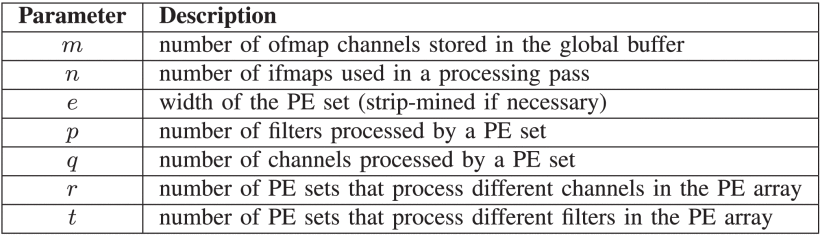

**TABLE II** 

**TABLE III** 

### B. Exploit Data Statistics

Even though the RS dataflow optimizes data movement for all data types, the intrinsic amount of data and the corresponding computation are still high. To further improve energy efficiency, data statistics of CNN is explored to: 1) reduce DRAM accesses using compression, which is the most energy consuming data movement per access, on top of the optimized dataflow; and 2) skip the unnecessary computations to save processing power ([Section V-C](#c-processing-element-and-data-gating)).

The ReLU function introduces many zeros in the fmaps by rectifying all negative filtering results to zero. While the number of zeros in the fmaps depends on the input data to the CNN, it tends to increase with deep layers. In AlexNet, almost 40% of ifmap values of CONV2 are zeros on average, and it goes up to around 75% at CONV5. In addition to the fmap, a recent study has also shown that 16%–78% filter weights in a CNN can be pruned to zero [\[33\]](ref33).

RLC is used in Eyeriss to exploit the zeros in fmaps and save DRAM bandwidth. [Fig. 8](img/ieee_7738524_fig8.gif) shows an example of RLC encoding. Consecutive zeros with a maximum run length of 31 are represented using a 5-b number as the  *Run*. The next value is inserted directly as a 16-b  *Level*, and the count for run starts again. Every three pairs of run and level are packed into a 64-b word, with the last bit indicating if the word is the last one in the code. Based on our experiments using AlexNet with the ImageNet data set, the compression rate of RLC only adds 5%–10% overhead to the theoretical entropy limit.

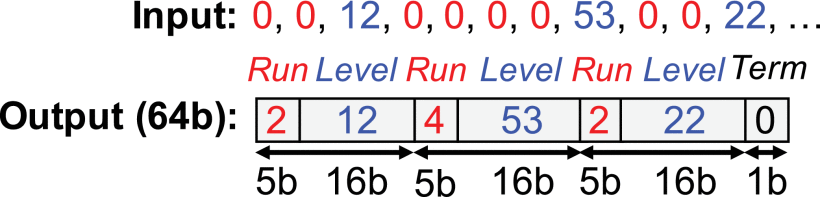

**Fig. 8.** Encoding of the RLC.

Except for the input data to the first layer of a CNN, all the fmaps are stored in RLC compressed form in the DRAM. The accelerator reads the encoded ifmaps from DRAM, decompresses it with the RLC decoder, and writes it into the GLB. The computed ofmaps are read from the GLB, processed by the ReLU module optionally, compressed by the RLC encoder, and transmitted to the DRAM. This saves both space and R/W bandwidth of the DRAM. From our experiments using AlexNet, the DRAM accesses for fmaps alone, including both ifmaps and ofmaps, can be saved by nearly 30% in CONV1, and nearly 75% in CONV5. [Fig. 9](img/ieee_7738524_fig9.gif) shows the overall DRAM accesses in AlexNet before and after RLC. The traffic includes filters, ifmaps, and ofmaps. The DRAM access could be further reduced if RLC was applied to filter weights.

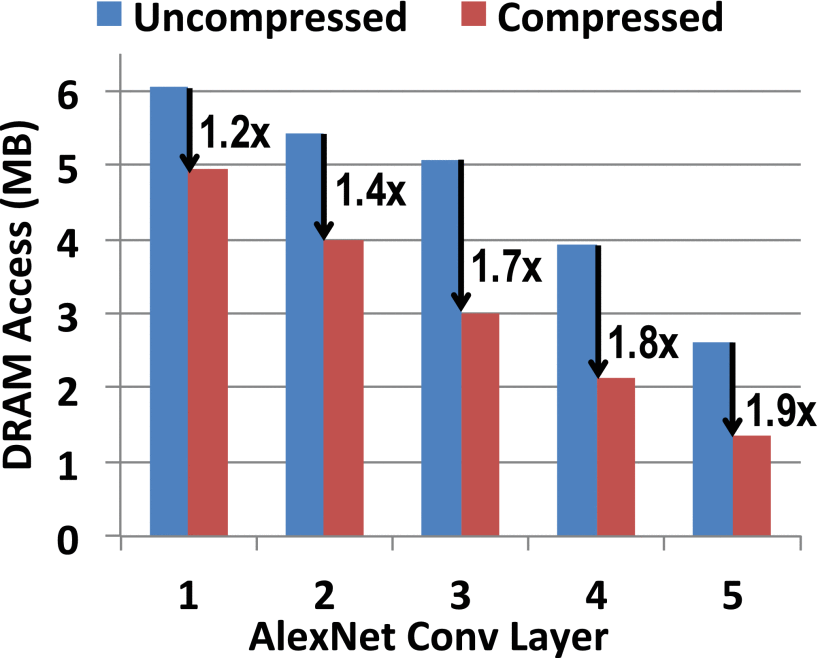

**Fig. 9.** Comparison of DRAM accesses (read and write), including filters, ifmaps, and ofmaps, before and after using RLC in the five CONV layers of AlexNet.

## System Modules

### A. Global Buffer

The Eyeriss accelerator has a GLB of 108 kB that can communicate with DRAM through the asynchronous interface and with the PE array through the NoC. The GLB stores all the three types of data: ifmaps, filters, and psums/ofmaps. 100 kB of the GLB is allocated for ifmaps and psums as required by the RS dataflow for reuse. Even though it is not required by the dataflow, the remaining 8 kB (two banks of 512-b $\times64$-b SRAMs) of the GLB is allocated for filter weights to compensate for insufficient off-chip traffic bandwidth. While the PE array is working on a processing pass, the GLB preloads the filters used by the next processing pass.

The 100-kB storage space for ifmaps and psums has to be reconfigurable to fit the two data types in different proportions for supporting different shapes ([Table III](img/ieee_7738524_table3.gif)). It also has to provide enough bandwidth for accesses from the PE array. To meet the two demands, the space is divided into 25 banks, each of which is a 512-b $\times 64$-b (4 kB) SRAM. Each bank is assigned entirely to ifmaps or psums, and the assignment is reconfigurable based on the scan chain bits. Therefore, the PE array can access both ifmaps and psums simultaneously, each from one of the 25 banks.

### B. Network-on-Chip

The NoC manages data delivery between the GLB and the PE array as well as between different PEs. The NoC architecture needs to meet the following goals. First, the NoC has to support the data delivery patterns used in the RS dataflow. While the data movement within a PE set is uniform ([Fig. 4](img/ieee_7738524_fig4.gif)), there are three scenarios in the mapping of real CNNs that can break the uniformity and should be taken care of: 1) different convolution strides ($U$) result in the ifmap delivery, skipping certain rows in the array (AlexNet CONV1 in [Fig. 5](img/ieee_7738524_fig5.gif)); 2) a set is divided into segments that are mapped onto different parts of the PE array (AlexNet CONV2 in [Fig. 5](img/ieee_7738524_fig5.gif)); and 3) multiple sets are mapped onto the array simultaneously and different data is required for each set (AlexNet CONV4 and CONV5 in [Fig. 5](img/ieee_7738524_fig5.gif)). Second, the NoC should leverage the data reuse achieved by the RS dataflow to further improve energy efficiency. Third, it has to provide enough bandwidth for data delivery in order to support the highly parallel processing in the PE array.

Conventional approaches usually use hop-by-hop mesh NoC at the cost of increased ramp-up time and router overhead [\[34\]](ref34), [\[35\]](ref35). To avoid this overhead, we chose to implement a custom NoC for the required data delivery patterns that is optimized for latency, bandwidth, energy, and area. The custom NoC comprises three different types of networks as described in the following.

#### 1) Global Input Network:

The global input network (GIN) is optimized for a single-cycle multicast from the GLB to a group of PEs that receive the same filter weight, ifmap value, or psum. [Fig. 5](img/ieee_7738524_fig5.gif) shows an example of ifmap delivery in AlexNet. The challenge is that the group of destination PEs varies across layers due to the differences in data type, convolution stride, and mapping. Broadcasting each data with a bit-vector tag of the same size of the PE array (i.e., 168 b), which indicates the IDs of destination PEs, can support any arbitrary mapping. However, doing so is also very costly in terms of both area and energy consumption due to the increased GIN bus width. Instead, we implemented the GIN, as shown in [Fig. 10](img/ieee_7738524_fig10.gif), with two levels of hierarchy: Y-bus and X-bus. A vertical Y-bus consists of 12 horizontal X-buses, one at each row of the PE array, and each X-bus connects to 14 PEs in the row. Each X-bus has a $row$ ID, and each PE has a $col$ ID. These IDs are all  *reconfigurable*, and a unique ID is given to each group of X-buses or PEs that receives the same data in a given CNN layer. Each data read from the GLB is augmented with a $(row, col)$ tag by the top-level controller, and the GIN guarantees that the data are delivered to  *all and only*  the X-buses and then PEs with the ID that matches the tag within a single cycle. The tag-ID matching is done using the  *Multicast Controller*  (MC). There are 12 MCs on the Y-bus to compare the $row$ tag with the $row$ ID of each X-bus, and 14 MCs on each of the X-buses to compare the $col$ tag with the $col$ ID of each PE. The unmatched X-buses and PEs are gated to save energy. For flow control, the data are passed from the GLB down to the GIN only when all destination PEs have issued a ready signal. An example of the $row$ and $col$ ID setup for ifmap delivery using GIN in AlexNet is shown in [Fig. 11](img/ieee_7738524_fig11.gif).

**Fig. 10.** Architecture of the GIN.

**Fig. 11.** rowIDs of the X-buses andcolIDs of the PEs for ifmap delivery using GIN in AlexNet layers. (a) CONV1. (b) CONV2. (c) CONV3. (d) CONV4 and CONV5. In this example, assuming the tag on the data hasrow=0andcol=3, the X-buses and PEs in red are the activated buses and PEs that receive the data, respectively.

Eyeriss has separate GINs for each of the three data types (filter, ifmap, and psum) to provide sufficient bandwidth from the GLB to the PE array. All GINs have 4-b $row$ IDs to address the 12 rows. The filter and psum GINs use 4-b $col$ IDs to address the 14 columns, while ifmap GIN uses 5 b to support maximum 32 ifmap rows passing in diagonal. The filter and psum GINs have data bus width of 64 b ($4 b\times 16$ b), while the ifmap GIN has the data bus width of 16 b.

#### 2) Global Output Network:

The GON is used to read the psums generated by a processing pass from the PE array back to the GLB. The GON has the same architecture as the GIN; only the direction of data transfer is reversed. The data bus width is also 64b as the psum GIN.

#### 3) Local Network:

Between every pair of PEs that are on two consecutive rows of the same column, a dedicated 64b data bus is implemented to pass the psums from the bottom PE to the top PE directly. Therefore, a PE can get its input psums either from the psum GIN or LN. The selection is static within a layer, which is controlled by the scan chain configuration bits and only depends on the dataflow mapping of the CNN shape.

### C. Processing Element and Data Gating

[Fig. 12](img/ieee_7738524_fig12.gif) shows the architecture of a PE. FIFOs are used at the I/O of each PE to balance the workload between the NoC and the computation. The numbers of filters ($p$) and channels ($q$) that the PE processes at once are statically configured into the control of a PE, which determines the state of processing. This configuration controls the pattern with which the PE steps through the three spads. The datapath is pipelined into three stages: one stage for spad access, and the remaining two for computation. The computation consists of a 16-b two-stage pipelined multiplier and adder. Since the multiplication results are truncated from 32 to 16 b, the selection of 16 b out of the 32 b is configurable, and can be decided by the dynamic range of a layer from offline experiments. Spads are separated for three data types to provide enough access bandwidth. The filter spad is implemented in a 224-b $\times 16$-b SRAM due to its large size; the ifmap and psum spads of size 12 b $\times 16$ b and 24 b $\times 16$ b, respectively, are implemented using registers.

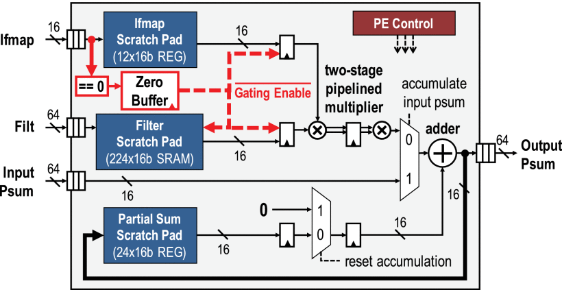

**Fig. 12.** PE architecture. The datapaths in red show the data gating logic to skip the processing of zero ifmap data.

Data gating logic is implemented to exploit zeros in the ifmap for saving processing power. An extra 12-b  *Zero Buffer*  is used to record the position of zeros in the ifmap spad. If a zero ifmap value is detected from the zero buffer, the gating logic will disable the read of the filter spad and prevent the MAC datapath from switching. Compared with the PE design without the data gating logic, it can save the PE power consumption by 45%.

## Results

The Eyeriss chip shown in [Fig. 13](img/ieee_7738524_fig13.gif) was implemented in 65-nm CMOS [\[36\]](ref36) and had been integrated into the Caffe framework [\[28\]](ref28) ([Fig. 14](img/ieee_7738524_fig14.gif)). [Table IV](img/ieee_7738524_table4.gif) lists a summary of the chip specifications. At 1 V, the peak throughput is 33.6 GMAC/s (GMACS) with a 200-MHz core clock. Most of the state-of-the-art CNNs have shapes that lie within the native support of Eyeriss, so they can easily leverage Eyeriss for acceleration with no modification required.

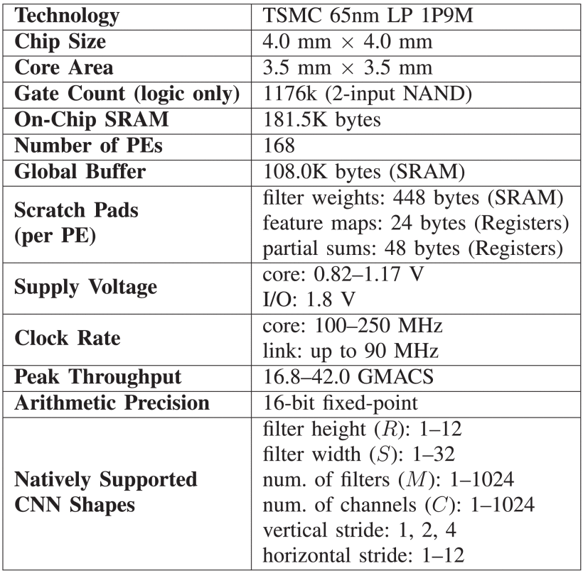

**TABLE IV** 

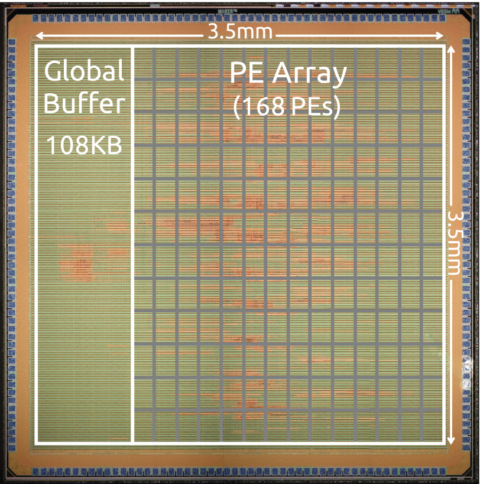

**Fig. 13.** Die micrograph and floorplan of the Eyeriss chip.

![Fig. 14. - Eyeriss-integrated deep-learning system that runs Caffe [28], which is one of the most popular deep-learning frameworks. The customized Caffe runs on the NVIDIA Jetson TK1 development board, and offloads the processing of a CNN layer to Eyeriss through the PCIe interface. The Xilinx VC707 serves as the PCIe controller and does not perform any processing. We have demonstrated an 1000-class image classification task [27] using this system, and a live demo can be found in [29].](img/ieee_7738524_fig14.gif)

**Fig. 14.** Eyeriss-integrated deep-learning system that runs Caffe[28], which is one of the most popular deep-learning frameworks. The customized Caffe runs on the NVIDIA Jetson TK1 development board, and offloads the processing of a CNN layer to Eyeriss through the PCIe interface. The Xilinx VC707 serves as the PCIe controller and does not perform any processing. We have demonstrated an 1000-class image classification task[27]using this system, and a live demo can be found in[29].

[Fig. 15(a)](img/ieee_7738524_fig15.gif) shows the area breakdown of the Eyeriss core, i.e., the area without I/O pads. It includes the logic cells, registers, and SRAMs from both the core and link clock domains. The area of the PE array includes all 168 PEs, and the area breakdown of each PE is shown in [Fig. 15(b)](img/ieee_7738524_fig15.gif). The spads from all PEs take nearly half of the total area, which is $2.5\times $ larger than that of the GLB. However, the aggregated capacity of the spads is 1.5 times smaller than the size of the GLB. Overall, the on-chip storage, including the GLB and all spads, takes two-thirds of the total area while the multipliers and adders from all 168 PEs only account for 7.4%.

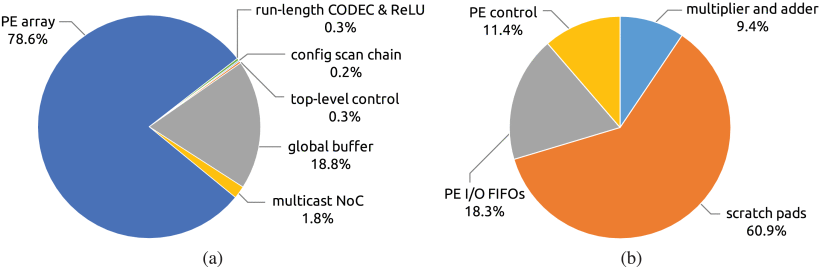

**Fig. 15.** Area breakdown of (a) Eyeriss core and (b) PE.

We benchmark the chip performance using two publicly available and widely used CNNs: AlexNet [\[2\]](ref2) and VGG-16 [\[3\]](ref3). The input frames are resized according to the requirement of each CNN: $227\times 227$ for AlexNet and $224\times 224$ for VGG-16. A batch size ($N$) of 4 and 3 is used for AlexNet and VGG-16, respectively; these batch sizes deliver the highest energy efficiency on Eyeriss according to the optimization in [\[32\]](ref32).

### A. AlexNet

[Table V](img/ieee_7738524_table5.gif) shows the measured performance breakdown of the five CONV layers in AlexNet at 1 V. The chip power consumption gradually decreases through deeper layers, since data gating can leverage more zeros in the ifmaps. On average, the Eyeriss chip achieves a frame rate of 34.7 frames/s, or equivalently a processing throughput of 23.1 GMACS. The measured chip power is 278 mW, and the corresponding energy efficiency is 83.1 GMACS/W. The actual throughput is lower than the peak throughput for three reasons: 1) only 88% of the PEs are active; 2) it takes time to load data from the GLB into the PE array to ramp up each processing pass; and 3) the chip does not perform processing while it is loading ifmap from DRAM or dumping ofmaps to DRAM. The last point, nevertheless, can be optimized with the refined control of the DRAM traffic at negligible cost. Therefore, we also providethe  *Processing Latency*  in [Table V](img/ieee_7738524_table5.gif) that shows the performance when DRAM traffic is fully overlapped with processing. For a batch of four frames, the required DRAM access is 15.4 MB, or 0.0029 access/MAC (37.4 access/input pixel).[2](fn2)

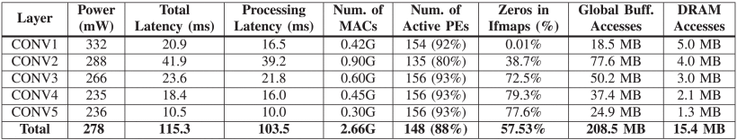

**TABLE V** 

[Fig. 16](img/ieee_7738524_fig16.gif) shows the power breakdown of the chip running CONV1 and CONV5. This is obtained by performing postplace and route simulations using actual workloads as in chip measurement. Different dataflow mappings and data reuse patterns result in different power distributions. Specifically, the power consumed in the spads as well as multipliers and adders is much lower in CONV5 than CONV1 due to the zeros in ifmaps. Overall, the ALUs only account for less than 10% of the total power, while data movement related components, including spads, GLB, and NoC, account for up to 45%. This confirms that data movement is more energy consuming than computation. Besides the clock network, the spads dominate on-chip power consumption, which shows that RS dataflow effectively reuses data locally for reducing DRAM accesses and optimizing overall system energy efficiency as estimated in [\[32\]](ref32). This is also why looking at the chip power alone is not sufficient to assess the energy efficiency of the system. [Fig. 17](img/ieee_7738524_fig17.gif) shows the impact of voltage scaling on-chip performance running AlexNet. The maximum throughput is 45 frames/s at 1.17 V, and the maximum energy efficiency is 122.8 GMACS/W at 0.82 V.

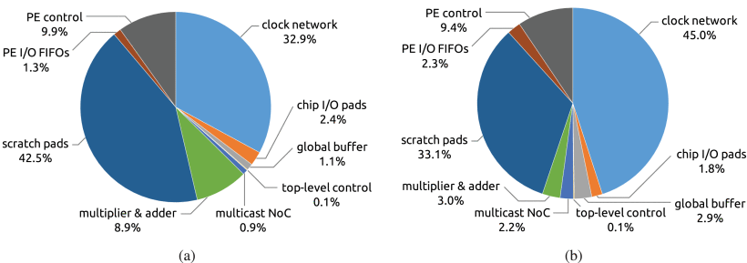

**Fig. 16.** Power breakdown of the chip running layer. (a) CONV1 and (b) CONV5 of AlexNet.

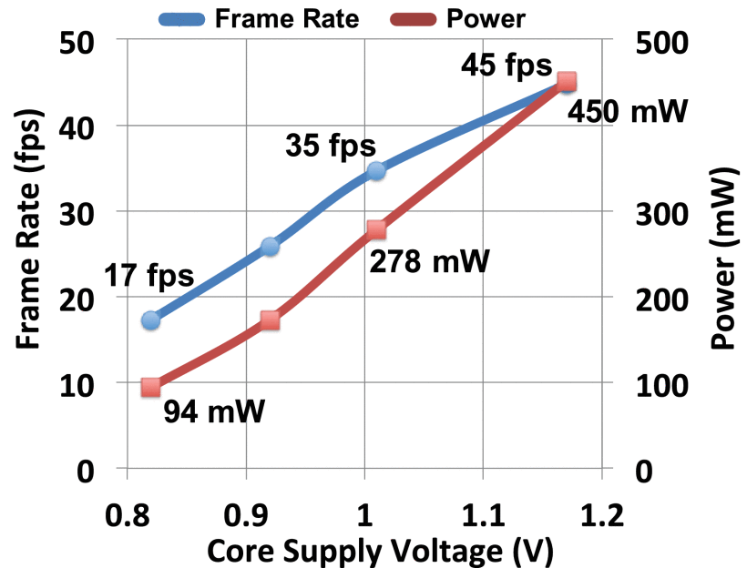

**Fig. 17.** Impact of voltage scaling on AlexNet Performance.

### B. VGG-16

[Table VI](img/ieee_7738524_table6.gif) shows the measured performance breakdown of the 13 CONV layers in VGG-16 at 1 V. On average, the chip operates at 0.7 frames/s with a measured power consumption of 236 mW. The frame rate is lower than that of AlexNet mainly since VGG-16 requires 23 times more computations per frame than AlexNet. The performance, however, depends not only on the computation but also on the shape configuration. For example, CONV1-2 and CONV4-2 have the same amount of MAC operations, but the former takes nearly four times longer to process than the latter. This is because the early layers require more processing passes than the deeper layers. Therefore, it spends more time on ramping up the processing in the PE array. The large number of processing passes is dictated by the large fmap size. The required DRAM access for a batch of three frames is 321.1 MB, or 0.0035 access/MAC (1066.6 access/input pixel).

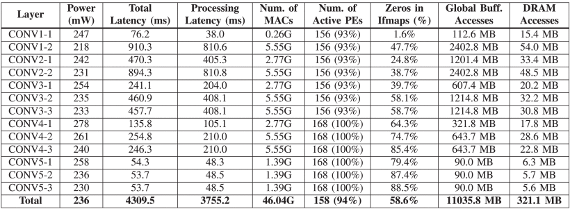

**TABLE VI** Performance Breakdown of the 13 CONV Layers in VGG-16 at 1 V. Batch Size ($N$ ) Is 3. The Core and Link Clocks Run at 200 and 60 MHz, Respectively

